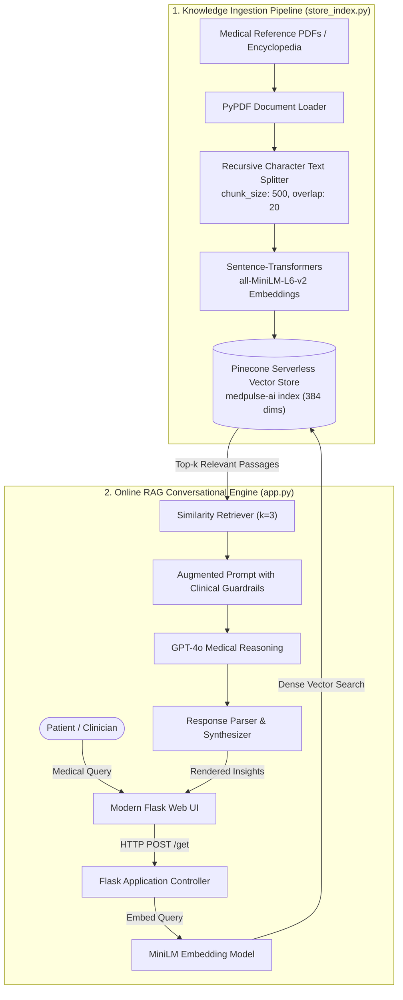

<div align="center">

# 🩺 MedPulse-AI
### *Intelligent RAG-Powered Healthcare Assistant & Clinical Query Engine*

[](https://www.python.org/)
[](https://flask.palletsprojects.com/)
[](https://www.langchain.com/)
[](https://www.pinecone.io/)
[](https://openai.com/)
[](LICENSE)

<p align="center">
  <b>MedPulse-AI</b> is a domain-specific clinical decision support and patient education assistant. By coupling <b>Retrieval-Augmented Generation (RAG)</b> with dense semantic embeddings in <b>Pinecone</b> and frontier LLMs, MedPulse delivers accurate, hallucination-resistant medical insights grounded directly in verified medical literature.
</p>

[Key Features](#-key-features) •
[Architecture](#-system-architecture) •
[Tech Stack](#-tech-stack) •
[Project Structure](#-project-structure) •
[Quickstart](#-quickstart--installation) •
[Disclaimer](#-clinical-disclaimer)

</div>

---

## 🔬 System Architecture

MedPulse-AI utilizes a two-phase architecture: an offline **Document Ingestion & Indexing Pipeline** and an online **Semantic Retrieval-Augmented Generation (RAG) Query Loop**.



---

## ✨ Key Features

- **Context-Grounded Answers (RAG)**: Queries are enriched with retrieved chunks from peer-reviewed medical encyclopedias, eliminating generic hallucinations.
- **Dense Vector Search**: Powered by Pinecone Serverless vector database and HuggingFace's `sentence-transformers/all-MiniLM-L6-v2` for low-latency similarity search across 384 dimensions.
- **Clinical Guardrails**: Custom prompt engineering strictly bounds the assistant to verified clinical facts, refusing speculative out-of-context medical claims.
- **Modern Clinical Web UI**: Fast, responsive, dark-mode healthcare dashboard with instant medical prompt suggestions, typing indicators, and mobile support.
- **Production-Ready Modularity**: Clean separation of ingestion pipelines, helper modules, templates, and RESTful routing with container health checks (`/health`).

---

## 🛠️ Tech Stack

| Component | Technology | Description |
| :--- | :--- | :--- |
| **Language** | Python 3.9+ | Core programming runtime |
| **Orchestration** | LangChain 0.3+ | Chains, document loaders, vector stores, and prompt templates |
| **Vector Database** | Pinecone | Serverless cloud vector index with cosine similarity |
| **Embeddings** | HuggingFace Sentence-Transformers | `all-MiniLM-L6-v2` generating 384-dimensional dense vectors |
| **LLM Provider** | OpenAI GPT-4o | Clinical reasoning and response formulation |
| **Web Server** | Flask | Lightweight WSGI web application framework |
| **Frontend** | HTML5 / Modern CSS / Vanilla JS | Sleek, dark-mode medical interface |

---

## 📂 Project Structure

```text
MedPulse-AI/
├── .env.example              # Template for environment variables and API keys
├── .gitignore                # Pinned ignore rules (prevents secret & cache leaks)
├── LICENSE                   # MIT Open-Source License
├── README.md                 # Complete documentation & architecture guide
├── requirements.txt          # Production dependencies
├── setup.py                  # Package configuration for medpulse-ai
├── template.sh               # Project scaffold generator script
├── app.py                    # Flask application & RAG query endpoint
├── store_index.py            # Medical knowledge base indexing & Pinecone upsert script
├── data/
│   └── .gitkeep              # Directory for medical reference PDFs
├── research/
│   └── trials.ipynb          # Jupyter prototyping & exploratory research notebook
├── src/
│   ├── __init__.py           # Package marker
│   ├── helper.py             # PDF loaders, chunkers, and embedding loaders
│   └── prompt.py             # Clinical system prompt and safety guidelines
├── static/
│   └── style.css             # Healthcare-themed responsive stylesheet
└── templates/
    └── chat.html             # Interactive patient chat interface
```

---

## 🚀 Quickstart & Installation

### 1. Clone or Navigate to the Repository
```bash
git clone https://github.com/<your-username>/MedPulse-AI.git
cd MedPulse-AI
```

### 2. Create and Activate a Virtual Environment
```bash
# macOS/Linux
python3 -m venv venv
source venv/bin/activate

# Windows
python -m venv venv
venv\Scripts\activate
```

### 3. Install Dependencies
```bash
pip install --upgrade pip
pip install -r requirements.txt
```

### 4. Configure Environment Variables
Create a `.env` file in the project root:
```bash
cp .env.example .env
```
Open `.env` and fill in your API credentials:
```ini
# Pinecone API Configuration
PINECONE_API_KEY="your-pinecone-api-key"
PINECONE_INDEX_NAME="medpulse-ai"

# OpenAI API Configuration
OPENAI_API_KEY="your-openai-api-key"

# Server Settings
PORT=8080
FLASK_DEBUG=1
```

> **Where to get API keys:**
> - [Pinecone Console](https://app.pinecone.io/) (Free serverless tier available)
> - [OpenAI Platform](https://platform.openai.com/api-keys)

---

## 📚 Knowledge Base Ingestion

MedPulse-AI indexes clinical knowledge from reference medical textbooks (such as *The Gale Encyclopedia of Medicine*).

1. Place your medical PDF documents inside the `data/` folder:
   ```bash
   cp /path/to/medical_encyclopedia.pdf data/
   ```

2. Run the ingestion pipeline:
   ```bash
   python store_index.py
   ```
   *This will parse the PDFs, generate semantic chunks, compute embeddings, create the Pinecone index if it doesn't already exist, and upsert all vector records.*

---

## 💻 Running the Web Application

Launch the Flask server:
```bash
python app.py
```

Once started, navigate to:
```
http://localhost:8080
```

### Health Check Endpoint
To inspect service status and vector connectivity:
```bash
curl http://localhost:8080/health
```
**Response:**
```json
{
  "index_name": "medpulse-ai",
  "service": "MedPulse-AI",
  "status": "healthy",
  "version": "1.0.0"
}
```

---

## 🩺 Example Clinical Queries

Try submitting the following queries in the interface:
- **Diagnostic Inquiries**: *"What are the classic diagnostic signs and early presentation of Type 2 Diabetes?"*
- **Acute First Aid**: *"What is the standard clinical first-aid protocol for managing second-degree burns?"*
- **Differential Pathology**: *"Explain the pathological differences between bacterial and viral meningitis."*
- **Preventive Care**: *"What evidence-based non-pharmacological interventions assist in reducing stage 1 hypertension?"*

---

## ⚠️ Clinical Disclaimer

> **IMPORTANT**: MedPulse-AI is built solely for educational, informational, and research purposes. It is **NOT** a certified medical diagnostic device and does not constitute formal medical advice, clinical diagnosis, treatment plans, or emergency triage. Users experiencing acute medical emergencies should immediately contact their local emergency services (e.g., 911 / 112) or seek attention from licensed healthcare professionals.

---

## 🤝 Contributing

Contributions are welcome! Please follow these steps:
1. Fork the Project
2. Create your Feature Branch (`git checkout -b feature/ClinicalFeature`)
3. Commit your Changes (`git commit -m 'feat: add ClinicalFeature'`)
4. Push to the Branch (`git push origin feature/ClinicalFeature`)
5. Open a Pull Request

---

## 📄 License

Distributed under the **MIT License**. See [`LICENSE`](LICENSE) for complete details.

---

<div align="center">
  Crafted with care by <b>Charan Kudithi</b>
</div>
